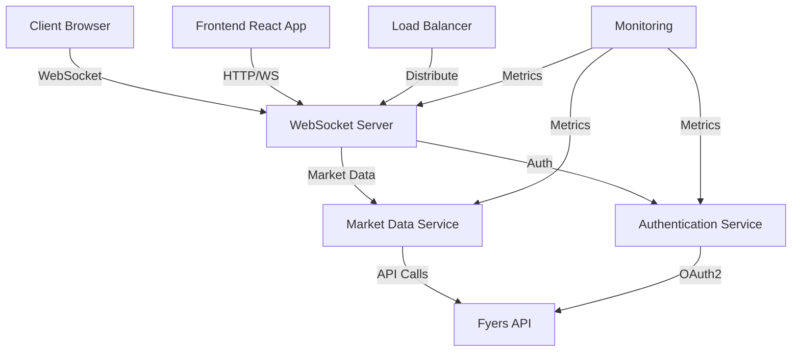
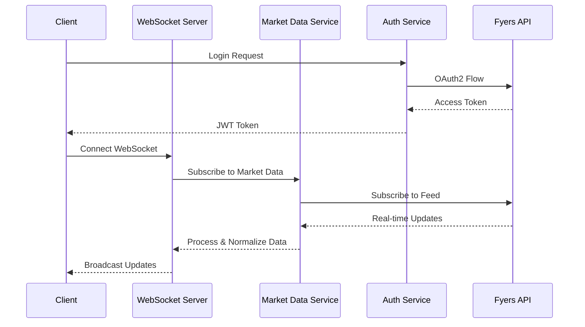
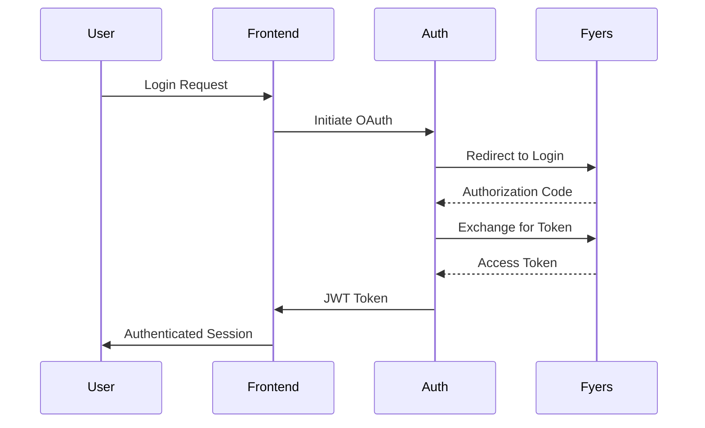

# LiveWebsocket System Design Documentation

## System Design Overview

The LiveWebsocket system is designed to provide real-time market data through a robust and scalable architecture. This document outlines the detailed system design, component interactions, and technical specifications.

## Component Architecture

## Data Flow Architecture

## Technical Specifications

### 1. Backend Services

#### WebSocket Server
- **Technology**: Flask-SocketIO
- **Protocol**: WebSocket (ws://, wss://)
- **Port**: 5000 (dev), 443 (prod)
- **Features**:
  - Real-time bidirectional communication
  - Room-based broadcasting
  - Connection state management
  - Error handling and reconnection

#### Market Data Service
- **Technology**: Python
- **Dependencies**: 
  - Fyers API SDK
  - WebSocket client
  - Data processing libraries
- **Features**:
  - Data normalization
  - Rate limiting
  - Error recovery
  - Data validation

#### Authentication Service
- **Technology**: Python
- **Protocol**: OAuth2
- **Security**:
  - JWT token management
  - Secure session handling
  - Token refresh mechanism

### 2. Frontend Architecture

#### React Application
- **Framework**: React 17+
- **State Management**: React Context
- **Key Libraries**:
  - Socket.IO Client
  - React Data Table
  - Styled Components
- **Features**:
  - Real-time updates
  - Responsive design
  - Theme switching
  - Data filtering

### 3. Infrastructure

#### Development Environment
- **Local Server**: Flask development server
- **Frontend**: React development server
- **SSL**: Self-signed certificates
- **Ports**:
  - Backend: 5000
  - Frontend: 3000

#### Production Environment
- **Web Server**: Nginx
- **Application Server**: Gunicorn
- **Process Manager**: Eventlet
- **SSL**: Let's Encrypt
- **Ports**:
  - HTTP: 80
  - HTTPS: 443
  - WebSocket: 443 (wss://)

## Security Design

### 1. Authentication Flow

### 2. Data Security
- SSL/TLS encryption
- Secure WebSocket connections
- Environment variable protection
- API key management

## Performance Considerations

### 1. Optimization Strategies
- WebSocket connection pooling
- Data compression
- Efficient data structures
- Caching mechanisms

### 2. Scalability
- Horizontal scaling capability
- Load balancing
- Stateless design
- Resource optimization

## Monitoring and Logging

### 1. Application Metrics
- Connection statistics
- Data throughput
- Error rates
- Response times

### 2. System Health
- Resource utilization
- Service availability
- Performance metrics
- Error tracking

## Deployment Strategy

### 1. Development
- Local development environment
- Hot reloading
- Debug tools
- Testing framework

### 2. Production
- Containerized deployment
- CI/CD pipeline
- Automated testing
- Blue-green deployment

## Future Enhancements

### 1. Technical Improvements
- Microservices architecture
- Database integration
- Caching layer
- API gateway

### 2. Feature Additions
- Additional market data sources
- Advanced analytics
- Machine learning integration
- Mobile application 